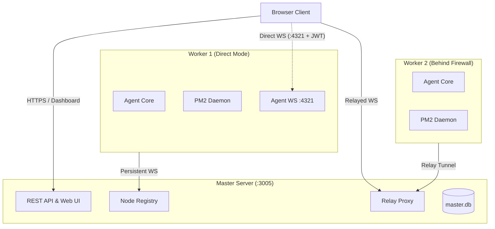
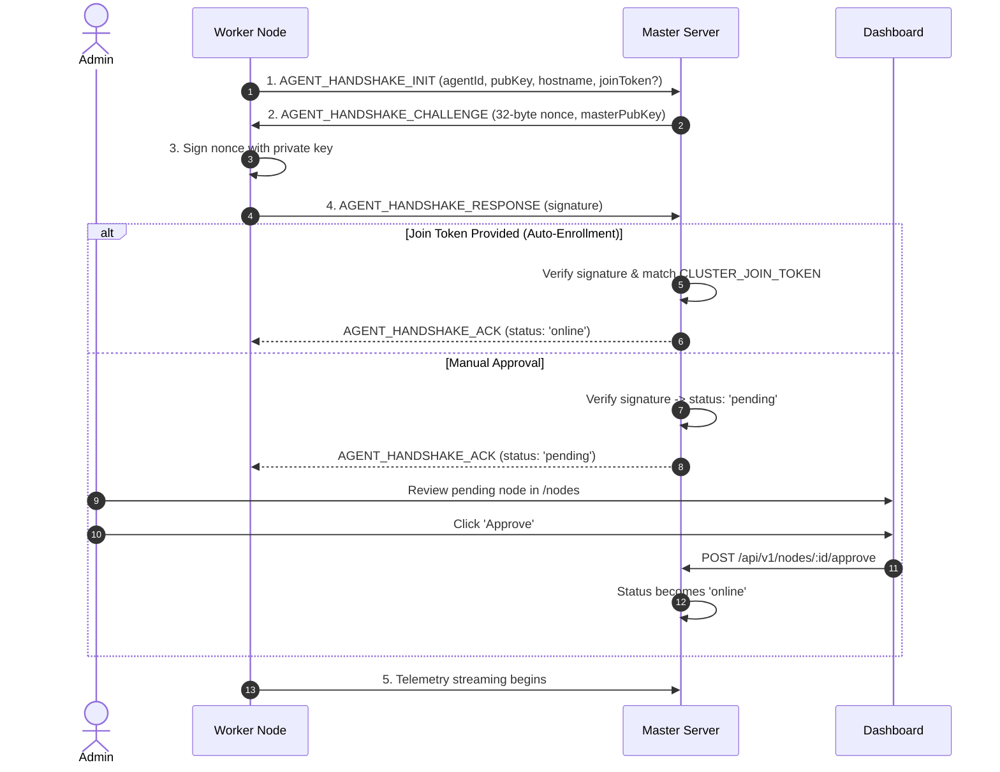

# PM2 Web UI

A self-hosted web dashboard and multi-server manager for PM2. Monitor, restart, stream logs, and deploy applications across multiple servers from a single interface.

---

## Features

- **Multi-Server Dashboard:** Monitor and manage PM2 instances across all your worker servers in one place.
- **Direct & Relay Connections:** Direct WebSocket connections for local/private networks, or transparent relay tunneling for nodes behind NAT and firewalls.
- **Node Authentication:** Ed25519 challenge-response handshake with manual approval or optional pre-shared join tokens (`JOIN_TOKEN`) for auto-scaling.
- **Log Streaming & Search:** Structured SQLite storage with gzip compression, multi-resolution summaries, search, and crash context inspection.
- **Command Queue:** Serialized PM2 execution queue to prevent concurrent IPC conflicts.
- **Cross-Server Operations:** Batch actions across servers and rolling Git deployments.
- **Access Control & Security:** Argon2id password hashing, TOTP two-factor authentication, scoped personal access tokens (PATs), and audit logging.

---

## Feature Comparison

| Feature                  |             PM2 Web UI              | PM2 Plus / Keymetrics |  Standard PM2 Web  |
| :----------------------- | :---------------------------------: | :-------------------: | :----------------: |
| **Hosting**              |      Self-hosted / On-premise       |    Cloud SaaS only    |       Local        |
| **Data Privacy**         | All telemetry stays in your network |   Third-party cloud   |       Local        |
| **Multi-Server Support** |        Yes (Unlimited nodes)        |      Paid tiers       | Single server only |
| **Firewall / NAT Relay** |        Built-in relay tunnel        |  Requires open ports  |   Not supported    |
| **Node Auth**            |     Ed25519 challenge-response      |      Secret keys      |        None        |
| **Auto-Join Tokens**     |         Yes (`JOIN_TOKEN`)          |        Manual         |   Not supported    |
| **Rolling Deployments**  |    Parallel & rolling strategies    |         Basic         |   Not supported    |
| **Persistent Logs**      |          SQLite WAL + Gzip          |   Limited retention   |    Stream only     |
| **2FA & API Tokens**     |         TOTP + Scoped PATs          |         Basic         |        None        |

---

## Monorepo Packages

```
packages/
├── shared/         # Common types, schemas, crypto utilities, protocol frames
├── agent-core/     # Worker runtime (PM2 wrapper, log engine, SQLite storage, WS client/server)
├── master/         # Master server (Fastify API, authentication, relay proxy, master database)
└── web/            # React dashboard (Tailwind CSS, TanStack Table & Virtual)
```

---

## Quick Start

### Prerequisites

- **Node.js:** `v20` or `v22+`
- **Package Manager:** `pnpm v10+`
- **PM2:** Installed globally on worker machines (`npm install -g pm2`)

### Installation & Build

```bash
# 1. Clone repository and install dependencies
git clone https://github.com/ImDarkShadow/pm2-webui.git
cd pm2-webui
pnpm install

# 2. Build packages
pnpm build

# 3. Run tests (optional)
pnpm test
```

### Running the Master Node

```bash
# Option 1: Direct via NPX
npx pm2-webui

# Option 2: Monorepo Development
cp .env.master.example .env
pnpm --filter @pm2-webui/master start
```

Default credentials:

- **Username:** `admin`
- **Password:** `adminpassword123`
- **URL:** `http://localhost:3005`

---

## Connecting Worker Nodes to Master

Worker machines run `@pm2-webui/agent-core`. Each agent connects to the master server over a persistent WebSocket connection, streaming metrics/logs and executing commands.



---

### Step 1: Ensure Master Server is Reachable

Make sure your master server is reachable from the worker node via its IP, private network (Tailscale / WireGuard), or reverse proxy (e.g. `http://master-ip:3005` or `https://pm2.yourdomain.com`).

---

### Step 2: Start the Worker Agent

On the remote worker machine:

#### Option A: Running with NPX or PNPM

```bash
# Direct via NPX:
MASTER_WS_URL=http://<master-ip>:3005 \
AGENT_HOSTNAME="worker-01" \
npx pm2-webui agent

# Monorepo development:
pnpm --filter @pm2-webui/agent-core start
```

#### Option B: Running with PM2 (Production)

Run the agent under PM2 so it automatically restarts on failure and system boots:

```bash
pm2 start packages/agent-core/dist/index.js \
  --name "pm2-webui-agent" \
  --env MASTER_WS_URL="http://<master-ip>:3005" \
  --env AGENT_HOSTNAME="worker-01" \
  --env AGENT_PORT=4321

pm2 save
pm2 startup
```

#### Option C: Systemd Service

Create `/etc/systemd/system/pm2-webui-agent.service`:

```ini
[Unit]
Description=PM2 Web UI Worker Agent
After=network.target

[Service]
Type=simple
User=root
WorkingDirectory=/opt/pm2-webui
Environment=NODE_ENV=production
Environment=MASTER_WS_URL=http://master-ip:3005
Environment=AGENT_HOSTNAME=worker-01
Environment=AGENT_PORT=4321
ExecStart=/usr/bin/node /opt/pm2-webui/packages/agent-core/dist/index.js
Restart=always
RestartSec=5

[Install]
WantedBy=multi-user.target
```

Enable and start:

```bash
sudo systemctl daemon-reload
sudo systemctl enable --now pm2-webui-agent
```

---

### Step 3: Approve Node Enrollment

When a worker connects for the first time, it generates an Ed25519 keypair and performs a challenge-response handshake with the master.



#### Method A: Approval via Web Dashboard

1. Open the dashboard (`http://<master-ip>:3005`).
2. Go to **Nodes** (`/nodes`).
3. Find the new node marked **Pending Approval**.
4. Click **Review Request** and select **Approve Enrollment**.

#### Method B: Automatic Enrollment (Join Token)

For automated server deployments (cloud-init, Ansible, EC2 auto-scaling):

1. Set `CLUSTER_JOIN_TOKEN` on the master:
   ```bash
   CLUSTER_JOIN_TOKEN="your-cluster-secret"
   ```
2. Pass `JOIN_TOKEN` on the worker:
   ```bash
   MASTER_WS_URL=http://<master-ip>:3005 \
   JOIN_TOKEN="your-cluster-secret" \
   AGENT_HOSTNAME="worker-01" \
   pnpm --filter @pm2-webui/agent-core start
   ```
   The node will be automatically approved and set to `online`.

#### Method C: Approval via REST API

```bash
curl -X POST http://<master-ip>:3005/api/v1/nodes/<NODE_ID>/approve \
  -H "Authorization: Bearer <JWT_OR_PAT>"
```

---

## Reverse Proxy Configuration

When running behind Nginx or Caddy, ensure WebSocket headers and long timeouts are configured.

### Nginx

```nginx
map $http_upgrade $connection_upgrade {
    default upgrade;
    ''      close;
}

server {
    listen 80;
    server_name pm2.yourdomain.com;
    return 301 https://$host$request_uri;
}

server {
    listen 443 ssl http2;
    server_name pm2.yourdomain.com;

    ssl_certificate /etc/letsencrypt/live/pm2.yourdomain.com/fullchain.pem;
    ssl_certificate_key /etc/letsencrypt/live/pm2.yourdomain.com/privkey.pem;

    location / {
        proxy_pass http://127.0.0.1:3005;
        proxy_http_version 1.1;

        # WebSocket headers
        proxy_set_header Upgrade $http_upgrade;
        proxy_set_header Connection $connection_upgrade;

        proxy_set_header Host $host;
        proxy_set_header X-Real-IP $remote_addr;
        proxy_set_header X-Forwarded-For $proxy_add_x_forwarded_for;
        proxy_set_header X-Forwarded-Proto $scheme;

        proxy_read_timeout 86400s;
        proxy_send_timeout 86400s;
        proxy_buffering off;
    }
}
```

### Caddy

```caddy
pm2.yourdomain.com {
    reverse_proxy 127.0.0.1:3005
}
```

---

## Environment Variables

Example files: [`.env.master.example`](./.env.master.example) and [`.env.agent.example`](./.env.agent.example).

### Master Node

| Variable             | Default                   | Description                                        |
| :------------------- | :------------------------ | :------------------------------------------------- |
| `PORT`               | `3005`                    | HTTP & WebSocket port for master API and dashboard |
| `MASTER_DATA_DIR`    | `~/.pm2-webui/master`     | Directory storing SQLite database (`master.db`)    |
| `JWT_SECRET`         | _(auto-generated)_        | 32+ character secret for JWT tokens and 2FA        |
| `ADMIN_USER`         | `admin`                   | Initial administrator username                     |
| `ADMIN_EMAIL`        | `admin@pm2-cluster.local` | Initial administrator email                        |
| `ADMIN_PASSWORD`     | `adminpassword123`        | Initial administrator password                     |
| `CLUSTER_JOIN_TOKEN` | _(none)_                  | Shared token for automatic worker enrollment       |
| `NODE_ENV`           | `development`             | Runtime environment (`production` / `development`) |

### Worker Node

| Variable                 | Default              | Description                                                                        |
| :----------------------- | :------------------- | :--------------------------------------------------------------------------------- |
| `MASTER_WS_URL`          | _(none)_             | Master URL (e.g. `http://master-ip:3005` or `wss://pm2.domain.com`). **Required.** |
| `JOIN_TOKEN`             | _(none)_             | Cluster join token matching `CLUSTER_JOIN_TOKEN`                                   |
| `AGENT_HOSTNAME`         | `os.hostname()`      | Display name shown in the dashboard                                                |
| `AGENT_PORT`             | `4321`               | Direct telemetry port for browser connections                                      |
| `AGENT_DATA_DIR`         | `~/.pm2-webui/agent` | Local database and log storage path                                                |
| `METRICS_INTERVAL_MS`    | `3000`               | Telemetry sampling interval in milliseconds                                        |
| `LOG_RETENTION_DAYS`     | `7`                  | Days to keep structured log records                                                |
| `METRICS_RETENTION_DAYS` | `30`                 | Days to keep historical metrics                                                    |

---

## Troubleshooting

<details>
<summary><strong>Why is a worker node stuck in "pending" status?</strong></summary>

New worker nodes remain pending until approved in **Nodes** (`/nodes`) on the dashboard, or until started with a matching `JOIN_TOKEN`.
</details>

<details>
<summary><strong>Can workers connect from behind a firewall or NAT?</strong></summary>

Yes. As long as the worker can initiate an outbound WebSocket connection to the master on port 3005 (or 443 via reverse proxy), telemetry and commands are multiplexed through the persistent relay connection.
</details>

<details>
<summary><strong>"PM2 Daemon is not currently active" warning</strong></summary>

Make sure PM2 is installed globally and running on the worker machine:

```bash
npm install -g pm2
pm2 ping
```

If PM2 was started by a specific user, run the worker agent under that same user so it can access the PM2 domain socket (`~/.pm2/rpc.sock`).
</details>

---

## Testing

```bash
# Run all tests
pnpm test

# Run tests by package
pnpm --filter @pm2-webui/shared test
pnpm --filter @pm2-webui/agent-core test
pnpm --filter @pm2-webui/master test
```

---

## License

This project is licensed under the [GNU Affero General Public License v3.0 (AGPL-3.0)](LICENSE).
