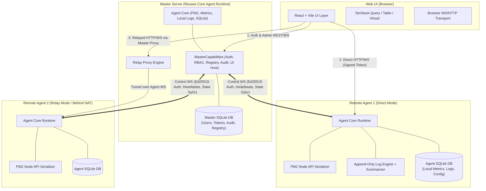

# Implementation Plan — PM2 Web UI (Master/Agent Distributed Platform)

## Goal Description

Build a production-ready, self-hosted distributed PM2 management platform capable of managing hundreds of remote servers running PM2 application clusters. The system features a unified core runtime where the Master node is simply an Agent with MasterCapabilities attached, Ed25519 cryptographic node identities, dual direct/relay network topology, progressive log resolution engine with zoomable exploration, local SQLite databases with versioned migrations, and high-concurrency serialized PM2 command execution.

---

## 📊 Milestone Tracker & Progress Checklist

### Overall Progress: `[24/24 Milestones Completed]`

#### Phase 1: Foundation & Core Protocols

- [x] **Milestone 1:** Repository Setup, Tooling & CI Pipeline _(pnpm monorepo, strict TS, ESLint, Prettier, GitHub Actions CI)_
- [x] **Milestone 2:** Shared Packages _(Types, Zod schemas, Ed25519 crypto helpers, WS protocol frames in `@pm2-webui/shared`)_
- [x] **Milestone 3:** Authentication & RBAC Engine _(Argon2id password hashing, JWT issue/verify, refresh tokens, role/permission evaluator)_
- [x] **Milestone 4:** Agent Cryptographic Trust Chain Protocol _(Pure Ed25519 keypair generation, challenge-response protocol, pure state machine & token signing in `@pm2-webui/shared`)_

#### Phase 2: Backend Architecture & Storage

- [x] **Milestone 5:** Master Backend & Persistent Storage _(Master Fastify server, master.db SQLite schema, versioned migrations, createUsersRepo, createNodesRepo, audit logger & persistent enrollment wiring)_
- [x] **Milestone 6:** Agent Core Backend Architecture _(AgentCore module lifecycle, config loader, Master control WS connection)_
- [x] **Milestone 7:** Local Agent SQLite Storage Engine _(agent.db setup, WAL mode, metrics & log tables, automated retention cleanup)_

#### Phase 3: Node Engine & PM2 Integration

- [x] **Milestone 8:** Serialized PM2 Execution Manager _(Async priority queue for PM2 Node API calls, event listeners for crash/restart)_
- [x] **Milestone 9:** Agent Metrics Engine _(Background metric collector for host & process CPU/RAM/Disk/Net via systeminformation)_
- [x] **Milestone 10:** Progressive Logging Subsystem _(Log ingestion ring buffer, byte offsets, gzip compression, 1s-1h summary tree builder, crash context)_
- [x] **Milestone 11:** Master & Agent REST APIs _(Zod-validated REST endpoints for Node mgmt, Process control, Logs, Metrics, Audit)_
- [x] **Milestone 12:** WebSocket Control & Relay Layer _(Socket.IO/WS server, auto-reconnect, incremental state updates, Master relay proxy for NAT nodes)_

#### Phase 4: Frontend Shell & Core UI

- [x] **Milestone 13:** Frontend Shell & Modern Design System _(React + Vite, Tailwind CSS, dark/light theme, WCAG 2.1 AA accessibility, App Shell)_
- [x] **Milestone 14:** Cluster Overview Dashboard _(Cluster health metrics, online/offline nodes, process counters, live aggregated charts)_
- [x] **Milestone 15:** Node Management UI _(TanStack Table node list, direct/relay indicators, enrollment approval drawer, group assigner)_
- [x] **Milestone 16:** Process Management Engine UI _(Global & per-node process table, status filters, multi-select, batch actions: start/stop/restart/reload/delete)_
- [x] **Milestone 17:** Deep Process Details & Metadata Inspector _(Live CPU/RAM sparklines, uptime, env var editor, restart history, PM2 metadata dump)_

#### Phase 5: Advanced Log Explorer, Monitoring & Alerting

- [x] **Milestone 18:** Zoomable Log Explorer UI _(Hierarchical zoom tree: 1h -> 10m -> 1m -> raw, TanStack Virtual scrolling, regex search, crash context view)_
- [x] **Milestone 19:** Advanced System & Process Monitoring UI _(Multi-axis historical charts for CPU, RAM, Disk I/O, Network, Load averages)_
- [x] **Milestone 20:** Global & Local Settings Manager _(Global retention policies, compression thresholds, notification webhooks, user preferences)_
- [x] **Milestone 21:** Real-time Notifications & Alerting Engine _(Web UI toast alerts, external webhooks: Discord, Slack, Email on crash/offline events)_

#### Phase 6: Performance, Hardening & DX

- [x] **Milestone 22:** Performance Optimization & Memory Hardening _(React memoization, WS message batching, SQLite query indexing, bundle optimization)_
- [x] **Milestone 23:** Production Hardening & Security Audit _(Fastify rate limiting, Helmet HTTP headers, input sanitization, Ed25519 token replay defense)_
- [x] **Milestone 24:** Documentation & Developer Experience _(Architecture docs, Docker Compose setup, auto-enrollment shell script, API reference)_

---

## Architecture Overview



---

## User Review Required

> [!IMPORTANT]
> **Key Architecture Decisions for Approval:**
>
> 1. **Unified Agent/Master Runtime:** The Master is not a separate application codebase; it initializes the standard `AgentCore` and conditionally mounts `MasterCapabilities` (Fastify API server for identity/RBAC, UI static assets, and relay proxying).
> 2. **Network Topology Autodetection & Relay Fallback:** Agents attempt direct reachability probes upon enrollment. If direct reachability fails or times out, the node falls back to `connectivity: "relay"`, routing browser control and log streams through an encrypted tunnel over the persistent Master↔Agent WebSocket.
> 3. **Serialized PM2 Command Queue:** Because the PM2 Node API (`pm2.connect()`, `pm2.list()`, `pm2.restart()`) is not thread-safe or safe for simultaneous concurrent calls, every node wraps PM2 calls in an in-memory priority queue (`AsyncQueue`) with strict timeout protections.
> 4. **Progressive Log Summarization Engine:** Logs are appended to SQLite in WAL mode with byte offsets. A background worker generates hierarchical summary buckets (1s, 10s, 1m, 10m, 1h) storing line counts, error counts, and keyword frequencies to enable instant zoomable rendering of millions of log lines without network overhead.
> 5. **Single-Master Availability Boundary (v1):** The Master database handles identity, node permissions, and audit logs. If the Master node goes down, Agents continue running PM2 processes, collecting metrics, and storing logs autonomously, but central web UI access is unavailable until Master recovers.

---

## Open Questions

> [!NOTE]
>
> 1. **Default Enrollment Mode:** Should newly discovered Agents require manual administrative approval in the UI by default, or should enrollment tokens with pre-bound node groups be the primary automatic onboarding mechanism? _(Proposed default: Require manual approval for unknown keys, auto-approve if valid scoped enrollment token is supplied)._
> 2. **Metrics Retention Policy:** The default proposed log retention is 7 days. Should historical CPU/RAM/Disk metrics use downsampling (e.g. 1-second raw for 24h, 1-minute averages for 30d) or simple age-based truncation? _(Proposed default: Downsample metrics after 24h to save disk)._

---

## Detailed System Specifications

### 1. Database Schemas & Migrations (better-sqlite3)

Both Master and Agent use `better-sqlite3` with `PRAGMA journal_mode = WAL;`, `PRAGMA synchronous = NORMAL;`, and a custom versioned schema migration runner (`migrations` table tracking `id`, `name`, `applied_at`).

#### Master SQLite Schema (`master.db`)

- **`users`**: `id` (UUIDv4), `username` (UNIQUE), `email` (UNIQUE), `password_hash` (Argon2id), `role_id`, `created_at`, `updated_at`.
- **`roles`**: `id`, `name` (Admin, Operator, Viewer), `description`, `is_system`.
- **`permissions`**: `id`, `role_id`, `action` (`node:view`, `process:restart`, `log:view`, `settings:update`), `resource_scope` (`global`, `group:id`, `node:id`).
- **`nodes`**: `id` (Agent UUID), `public_key` (Ed25519 Base64), `hostname`, `ip_address`, `connectivity_mode` (`direct` | `relay` | `unknown`), `status` (`online` | `offline` | `pending`), `version`, `last_seen_at`, `enrolled_at`.
- **`node_groups`**: `id`, `name`, `description`, `created_at`.
- **`node_group_members`**: `node_id`, `group_id`.
- **`audit_logs`**: `id` (INTEGER PRIMARY KEY AUTOINCREMENT), `timestamp`, `user_id`, `node_id`, `process_name`, `action`, `status`, `ip_address`, `details_json`.
- **`global_settings`**: `key` (PRIMARY KEY), `value_json`, `updated_at`.
- **`sessions`**: `id`, `user_id`, `refresh_token_hash`, `expires_at`, `revoked_at`.

#### Agent SQLite Schema (`agent.db`)

- **`agent_meta`**: `key` (PRIMARY KEY), `value`. Stores node keypair, master public key, node ID.
- **`metrics_hourly`**: `timestamp` (INTEGER), `cpu_usage`, `memory_used`, `memory_free`, `swap_used`, `disk_used`, `network_rx`, `network_tx`, `load_1m`.
- **`log_segments`**: `id` (INTEGER PRIMARY KEY AUTOINCREMENT), `process_name`, `stream` (`stdout` | `stderr`), `start_timestamp`, `end_timestamp`, `line_count`, `byte_offset`, `compressed_file_path`.
- **`log_summaries`**: `id`, `process_name`, `granularity` (`1s`, `10s`, `1m`, `10m`, `1h`), `bucket_timestamp`, `line_count`, `error_count`, `warn_count`, `sample_text`.
- **`crash_events`**: `id`, `process_name`, `pm_id`, `exit_code`, `signal`, `crashed_at`, `logs_before_json`, `logs_after_json`.

---

### 2. Cryptographic Security & Trust Chain

```
[Agent Initial Startup]
1. Generate Ed25519 Key Pair (private_key, public_key) -> Save to agent.db (restricted permissions 0600).
2. Connect to Master WS: `/api/v1/agent/connect`
3. Send Handshake Header:
   - X-Agent-ID: <Node UUID>
   - X-Agent-PubKey: <Ed25519 Public Key>
   - X-Agent-Signature: Ed25519_Sign(Challenge + Timestamp, PrivateKey)

[Master Verification]
1. Verify signature against Agent PubKey.
2. Check `nodes` table:
   - If known & approved: Issue Master Session Ack + Capability Negotiation.
   - If pending: Place in quarantine queue until Admin approves in UI.
   - If revoked: Terminate connection immediately.

[Browser -> Agent Direct Connection Token]
1. Browser calls Master REST: `POST /api/v1/nodes/:nodeId/token`
2. Master verifies RBAC permission (`node:view` / `process:manage`).
3. Master issues short-lived JWT (2 minutes expiry) signed with Master Ed25519 Private Key containing:
   `{ sub: userId, nodeId, permissions: ["process:restart", "log:view"], exp }`
4. Browser opens WS directly to `http(s)://<Agent-IP>:<Port>/ws?token=...`
5. Agent verifies JWT signature using Master's Public Key (cached at enrollment).
```

---

### 3. Log Engine Architecture & Zoomable Explorer

```
[PM2 Log Stream]
       │
       ▼
[Log Ingestion Queue (Batching & SQLite WAL Write)]
       │
       ├─────────────────────────────────┐
       ▼                                 ▼
[Raw Log Storage (Ring Buffer)]   [Summary Aggregator Worker]
(Rotated & Compressed > 10MB)     (Generates 1s, 10s, 1m, 10m, 1h resolution trees)
                                         │
                                         ▼
                                  [Zoomable Log API]
                                  GET /api/v1/logs/tree
```

---

## Proposed Changes & File Structure

The project will be built as a modular TypeScript monorepo using `pnpm` workspaces:

```
/home/pdas/Downloads/hos/pm/
├── package.json
├── pnpm-workspace.yaml
├── tsconfig.base.json
├── .eslintrc.js
├── .prettierrc
├── packages/
│   ├── shared/                 # Shared types, Zod schemas, Ed25519 crypto, protocol definitions
│   │   ├── src/
│   │   │   ├── types/          # System interfaces (Node, Process, Log, User, Metric)
│   │   │   ├── schemas/        # Zod validation schemas for APIs & WebSocket frames
│   │   │   ├── crypto/         # Ed25519 signature & JWT verification helpers
│   │   │   └── protocol/       # WS frame formats & message type constants
│   │   └── package.json
│   ├── agent-core/             # Unified Agent Runtime (PM2 queue, Log Engine, SQLite, WS client/server)
│   │   ├── src/
│   │   │   ├── db/             # SQLite connection, WAL config, versioned migrations
│   │   │   ├── pm2/            # Serialized PM2 execution queue & listener
│   │   │   ├── logging/        # Log ingestion engine, summarizer, compression, viewer API
│   │   │   ├── metrics/        # System & process metric collectors (systeminformation + PM2)
│   │   │   ├── transport/      # WebSocket server (direct browser) & client (Master control tunnel)
│   │   │   └── AgentCore.ts    # Main Agent lifecycle coordinator
│   │   └── package.json
│   ├── master/                 # MasterCapabilities (Fastify server, RBAC, Relay proxy, UI static server)
│   │   ├── src/
│   │   │   ├── auth/           # Argon2id, JWT identity provider, permission checker
│   │   │   ├── registry/       # Node enrollment manager & reachability prober
│   │   │   ├── relay/          # WebSocket & HTTP stream relay proxy
│   │   │   ├── audit/          # Append-only audit logger service
│   │   │   ├── server.ts       # Fastify server initialization
│   │   │   └── index.ts        # Master entrypoint (starts AgentCore + MasterCapabilities)
│   │   └── package.json
│   └── web/                    # React Frontend UI (Vite, Tailwind, shadcn/ui, TanStack ecosystem)
│       ├── src/
│       │   ├── components/     # Reusable UI elements (Tables, Charts, LogViewer, Badges)
│       │   ├── pages/          # Dashboard, Nodes, ProcessManager, ProcessDetails, LogExplorer, Settings
│       │   ├── hooks/          # TanStack Query hooks, WebSocket hooks, Terminal hooks
│       │   ├── store/          # Zustand state management (Theme, Auth, Selected Node)
│       │   ├── lib/            # Direct/Relay API client selector & formatting utilities
│       │   └── App.tsx
│       └── package.json
└── scripts/
    ├── dev.sh
    └── build.sh
```

---

## 24-Milestone Implementation Roadmaps & Definitions of Done

### Milestone 1: Repository Setup, Tooling & CI Pipeline

- **Scope:** Root monorepo setup (pnpm workspace), TypeScript base configs, ESLint, Prettier, SQLite migration runner scaffold, GitHub Actions CI workflow.
- **Definition of Done:** `pnpm typecheck`, `pnpm lint`, and `pnpm test` run cleanly in CI across all workspace packages.

### Milestone 2: Shared Packages (Types, Schemas & Protocols)

- **Scope:** Standardize data contracts (`NodeState`, `ProcessInfo`, `LogSummary`, `MetricFrame`, `WSMessage`), Zod validators, and protocol constants in `@pm2-webui/shared`.
- **Definition of Done:** 100% test coverage on Zod schema parsing and protocol payload validation.

### Milestone 3: Authentication & RBAC Engine

- **Scope:** Master identity provider module: Argon2id password hashing, JWT issue/verify, refresh token handling, and role/permission matrix evaluator (`canUserPerformAction(user, action, node)`).
- **Definition of Done:** Integration tests validating token lifecycle, expired token handling, and permission matrix authorization logic.

### Milestone 4: Agent Cryptographic Trust Chain Protocol

- **Scope:** Agent Ed25519 keypair generator, challenge-response handshake protocol, pure enrollment state machine transitions (`transitionEnrollmentState`), and Master delegation token signing logic in `@pm2-webui/shared`.
- **Definition of Done:** 100% unit test coverage validating cryptographic handshakes, tamper resistance, state transitions, and delegation token issuance/verification without requiring database access.

### Milestone 5: Master Backend & Persistent Storage

- **Scope:** Master SQLite database setup (`master.db`) with versioned migration engine, repository implementations (`createUsersRepo`, `createNodesRepo`, `createAuditRepo`, `createSettingsRepo`), audit logger, Fastify server plugins, and wiring the M4 enrollment protocol into persistent Master storage and REST routes.
- **Definition of Done:** Master database migrations execute cleanly; repositories pass integration tests; Master REST endpoints and persistent enrollment pipeline operational with SQLite backend.

### Milestone 6: Agent Core Backend Architecture

- **Scope:** Implement standalone `AgentCore` module responsible for node lifecycle, configuration loading, local storage init, and control channel connection.
- **Definition of Done:** AgentCore boots independently, establishes WS connection to Master, and maintains ping/pong keepalives.

### Milestone 7: Local Agent SQLite Storage Engine

- **Scope:** Agent `better-sqlite3` database initialization, WAL journal mode configuration, metrics tables, log storage tables, and cleanup routines.
- **Definition of Done:** Fast concurrent reads and writes executed without event loop blocking; automated cleanup purges data older than configured retention.

### Milestone 8: Serialized PM2 Execution Manager

- **Scope:** Async priority queue wrapping `pm2` Node API calls (`list`, `describe`, `start`, `stop`, `restart`, `delete`). Event listener for process crashes/restarts.
- **Definition of Done:** Concurrent process action requests queued cleanly without PM2 API race conditions or process state corruption.

### Milestone 9: Agent Metrics Engine

- **Scope:** Background metric collector capturing host stats (CPU, RAM, Swap, Disk, Network, Load via `systeminformation`) and process stats (CPU, Memory, Handles).
- **Definition of Done:** Real-time metrics broadcasted over local WebSocket and aggregated into SQLite hourly tables.

### Milestone 10: Progressive Logging Subsystem

- **Scope:** Log ingestion engine with byte offset indexing, retention cleaner, transparent gzip compression, hierarchical summary tree builder (1s to 1h), and crash context extractor.
- **Definition of Done:** Log tree API returns hierarchical summaries; raw log range requests return fast paginated log slices; crash context captures pre- and post-crash logs accurately.

### Milestone 11: Master & Agent REST APIs

- **Scope:** REST endpoints for Node management, Process controls, Log queries, Metrics fetching, and Audit trail access with strict Zod request/response validation.
- **Definition of Done:** All REST APIs documented, error handled, and verified with integration test suites.

### Milestone 12: WebSocket Control & Relay Layer

- **Scope:** Real-time Socket.IO / WebSocket layer with compression, auto-reconnect, incremental updates, and Master relay proxying for nodes behind NAT.
- **Definition of Done:** Transparent routing tested for both direct connections and relayed connections with low latency.

### Milestone 13: Frontend Shell & Modern Design System

- **Scope:** React + Vite SPA setup, Tailwind CSS styling, dark/light theme switcher, accessibility baseline (WCAG 2.1 AA), main layout shell, navigation bar, and user profile drawer.
- **Definition of Done:** Responsive app shell renders cleanly with responsive layout, zero console errors, and WCAG compliant contrast.

### Milestone 14: Cluster Overview Dashboard

- **Scope:** Interactive dashboard displaying aggregated cluster health, total nodes online/offline, process count status badges, live aggregated CPU/RAM charts (Recharts), and recent audit log feed.
- **Definition of Done:** Real-time data streams update dashboard metrics dynamically without UI lag or memory leaks.

### Milestone 15: Node Management UI

- **Scope:** TanStack Table list of all nodes, connectivity status indicators (`direct` vs `relay`), manual enrollment approval drawer, node detail modal, and group assigner.
- **Definition of Done:** Admins can approve pending nodes, inspect reachability, assign node groups, and filter nodes seamlessly.

### Milestone 16: Process Management Engine UI

- **Scope:** Global and per-node process table with search, status filtering, multi-select checkboxes, and batch action controls (Start, Stop, Restart, Reload, Delete).
- **Definition of Done:** Batch restart/stop operations execute smoothly with confirmation dialogs and live UI feedback.

### Milestone 17: Deep Process Details & Metadata Inspector

- **Scope:** Detailed process page featuring live CPU/RAM sparklines, uptime timer, environment variable viewer/editor, restart history timeline, and PM2 configuration dump. Env vars are masked by default (e.g. `API_KEY=••••••••`) with an explicit per-value "reveal" action gated by the `process:manage` permission; revealing a value is written to the audit log.
- **Definition of Done:** Real-time process metrics stream into graphs; process restarts reflect instantly in history; env var values are masked on initial render and unmasking is both permission-checked and audit-logged.

### Milestone 18: Zoomable Log Explorer UI

- **Scope:** Hierarchical zoomable log explorer (`1h -> 10m -> 1m -> raw`), virtualized log line viewer (TanStack Virtual), regex search bar, highlight filters, auto-scroll toggle, download button, and crash context split-screen.
- **Definition of Done:** 100,000-line logs navigate fluently at 60 FPS without memory inflation as the milestone acceptance bar; crash context loads in 1 click. (500,000-line ingestion is a separate stress test — see Verification Plan — and is not a blocking condition for this milestone.)

### Milestone 19: Advanced System & Process Monitoring UI

- **Scope:** Dedicated monitoring section with historical multi-axis charts for CPU, RAM, Disk I/O, Network traffic, and Load Averages over selectable time ranges (1h, 24h, 7d, 30d).
- **Definition of Done:** Historical charts render smooth zoomable time-series datasets fetched directly from Agent SQLite endpoints.

### Milestone 20: Global & Local Settings Manager

- **Scope:** UI for editing global retention policies, log compression thresholds, notification webhooks, user security settings, and theme customization.
- **Definition of Done:** Settings updates persist cleanly in Master SQLite and propagate instantly to connected Agents.

### Milestone 21: Real-time Notifications & Alerting Engine

- **Scope:** Event notification processor triggering web UI toast notifications and external webhooks (Discord, Slack, Email) on process crash, high CPU, or node offline events.
- **Definition of Done:** Simulated process crash generates instant toast notification and fires configured webhook payload.

### Milestone 22: Performance Optimization & Memory Hardening

- **Scope:** React component memoization, WebSocket message batching, virtual scrolling audit, SQLite query indexing, and frontend bundle size optimization.
- **Definition of Done:** Frontend bundle size, Agent idle RAM, and Master relay concurrent-stream capacity are each measured and recorded as of Milestone 1–2 baselines; this milestone reduces them by a meaningfully measurable margin (target regressions to zero) rather than against fixed numbers picked in advance. Master relay concurrency in particular should be validated against a realistic worst case — a meaningful fraction of "hundreds of nodes" running in relay mode simultaneously, not an arbitrary small figure — since NAT'd Agents are the expected common case, not the exception.

### Milestone 23: Production Hardening & Security Audit

- **Scope:** Rate limiting on Fastify routes, HTTP security headers (Helmet), input sanitization, Ed25519 token replay defense, strict CORS policies, and key rotation procedures.
- **Definition of Done:** Security audit clean; rate limit tests pass; non-authorized access attempts blocked and audited.

### Milestone 24: Documentation & Developer Experience

- **Scope:** Comprehensive architecture documentation, self-hosting Docker Compose files, Agent setup script (`curl -sfL https://... | sh`), API reference guide, and troubleshooting guide.
- **Definition of Done:** Complete deployment package tested on clean Linux VM with multi-node orchestration.

---

## Verification Plan

### Automated Tests

- **Unit Tests:** `pnpm test:unit` — Tests schemas, RBAC logic, Ed25519 signing, log summarization algorithms, and queue serialization.
- **Integration Tests:** `pnpm test:integration` — Spawns temporary Fastify Master and Agent instances with temp-file SQLite databases to test REST endpoints and WebSocket protocols.
- **E2E Tests:** `pnpm test:e2e` — Automated workflow testing Agent enrollment -> Admin Approval -> Token Issue -> Direct Process Control -> Log Retrieval.

### Manual Verification

1. **Direct vs Relay Topology Test:** Run Agent behind restricted firewall and verify Master relay proxying works seamlessly.
2. **Relay Scale Test:** Simulate a realistic worst-case fraction of the target fleet (e.g. 30–50% of nodes in relay mode at "hundreds of nodes" scale) connecting through the Master simultaneously; confirm latency and Master resource usage stay within acceptable bounds, and record the actual concurrent-stream ceiling for the record — not a number assumed in advance.
3. **PM2 Concurrency Stress Test:** Trigger 50 rapid process restart requests simultaneously to ensure serialized queue prevents PM2 API locks.
4. **Log Scale Test (stress tier):** Ingest 500,000 log lines into Agent log engine and verify zoomable UI navigation stays responsive under 100ms. This is a stress-test ceiling beyond the 100,000-line Milestone 18 acceptance bar, not a blocking requirement for that milestone.
5. **Env Var Masking Test:** Confirm environment variable values render masked by default on the process details page, that "reveal" is permission-gated, and that each reveal action is written to the audit log.
